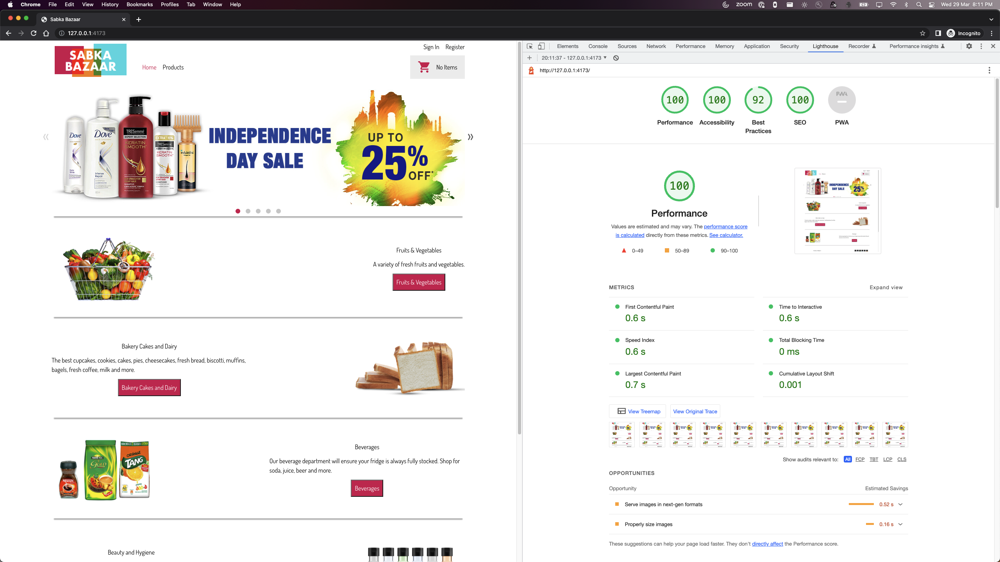
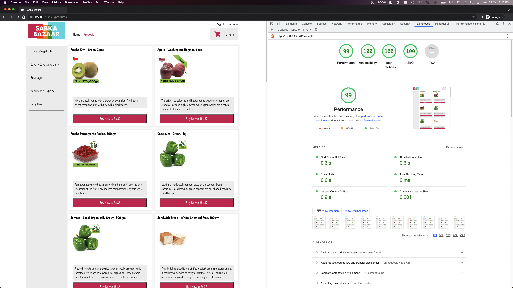
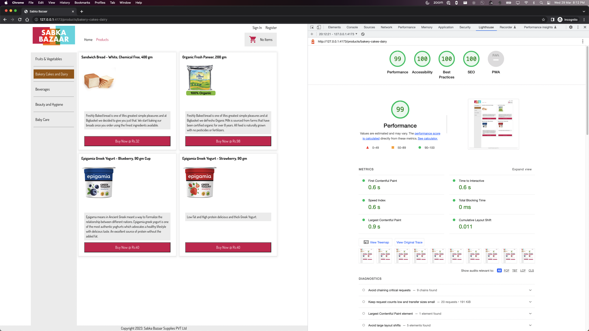
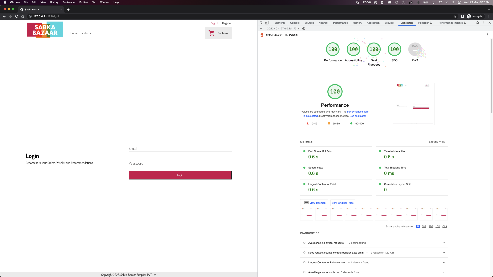
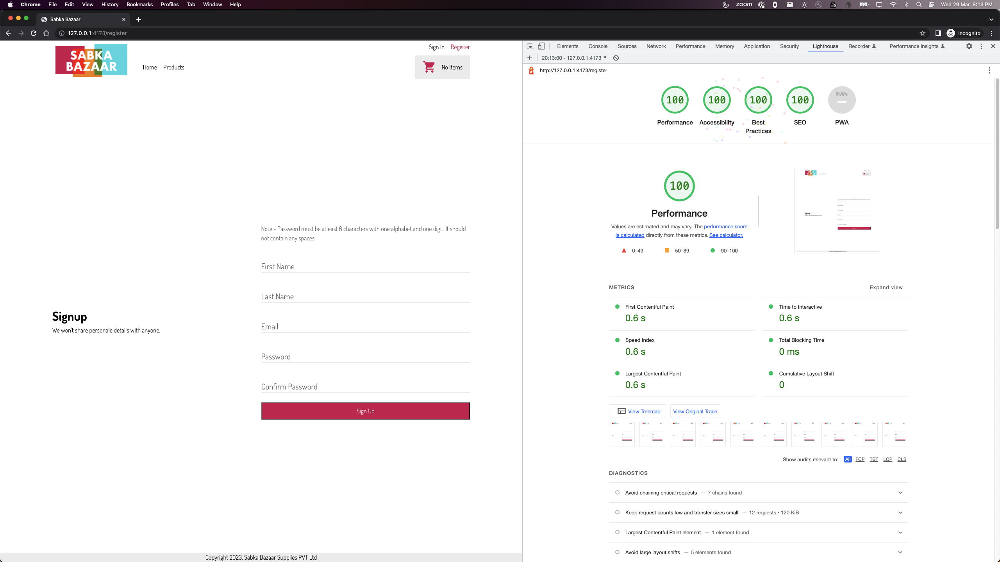
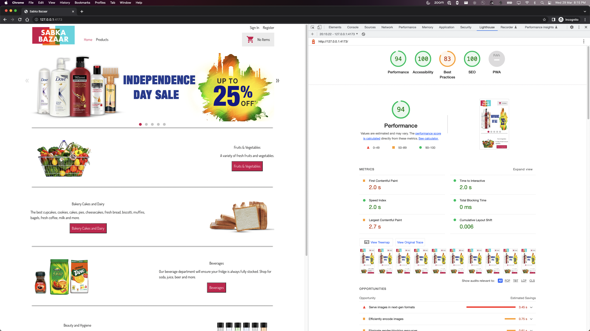
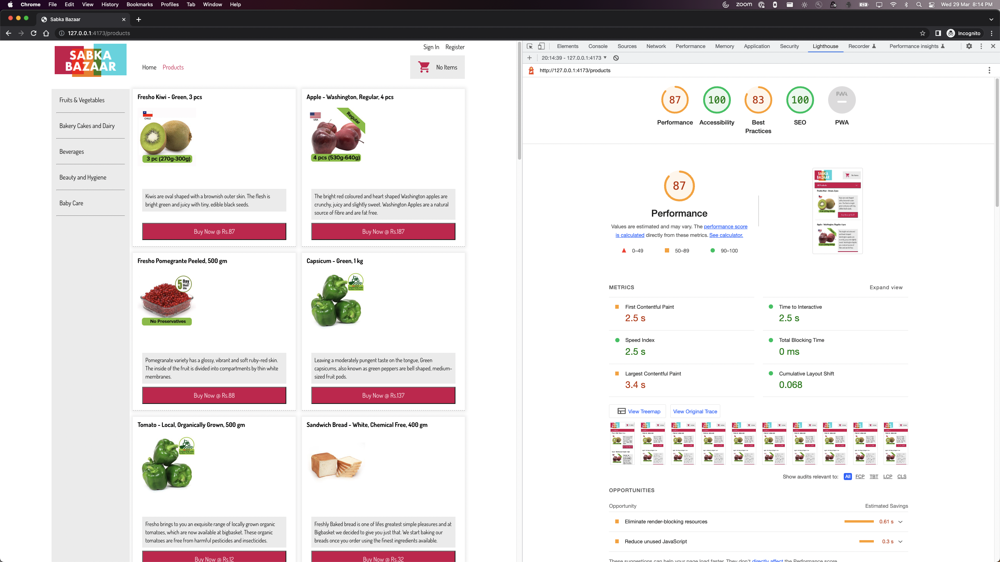

# XT Shopping Cart Assignment

The frontend is built using react with [Vite](https://vitejs.dev/).

## Highlights

- Uses [React Router v6+](https://reactrouter.com/en/main)
  - No more data fetching with `useEffect`.
  - All the data are loaded by new [Data Loader APIs](https://reactrouter.com/en/main/start/overview#data-loading).
  - Uses [Nested Layouts](https://reactrouter.com/en/main/start/overview#nested-routes) for parallel data fetching.
  - All the routes are [lazy-loaded](https://reactrouter.com/en/main/route/lazy#lazy) for faster load times.
- Uses [Radix UI](https://www.radix-ui.com/docs/primitives/overview/introduction)
  - Headless components with built in accessibility.
  - Radix components are loaded with `React.lazy()`, so the library is imported only when the component is requested.
    - Dialog would be loaded on click of cart button.
    - Accordian would be loaded only on mobile layout.
- Styling
  - CSS Modules
    - For styles splitting. Loading only the styles required for the component.
    - Make use of CSS Modules Variables.
  - Uses color thememing with CSS variables.
- Testing
  - Uses [Vitest](https://vitest.dev/), React testing library and jest-dom

## Running locally

Clone this repo and run following command for starting the mock server:

```
npm install
npm run start
```

Before running `client`, make sure you have node version 14+

```
node --version
// Should be above 14+
```

To install latest node version, follow the steps in [nvm documentation](https://github.com/nvm-sh/nvm)

Then navigate to `client` directory, install dependencies and start vite dev server

```
cd client
npm install
npm run dev
```

## Bundling for Production

Create the production build

```
cd client
npm run build
```

## Test the production build locally

To manually test the application End to end locally.

Open a terminal and start server at port 5000.

```
npm start
```

Open another terminal and run the production build with `vite preview`

```
cd client
npm run build
npm run preview
// Open the URL displayed on browser
```

You should now be able to test all the functionalities.

## Lighthouse Results

### Desktop







### Mobile




## FAQ

1. Why not Create React App?

- [Vite is the official recommendation from React team](https://react.dev/learn/start-a-new-react-project#can-i-use-react-without-a-framework)
- [Future of Create React App](https://github.com/reactjs/react.dev/pull/5487#issuecomment-1409720741)

2. Why Vite?

Ans: https://vitejs.dev/guide/why.html

3. What are the benefits of fetching data with React Router Apis?

Ans: [When to fetch](https://www.youtube.com/watch?v=95B8mnhzoCM)
